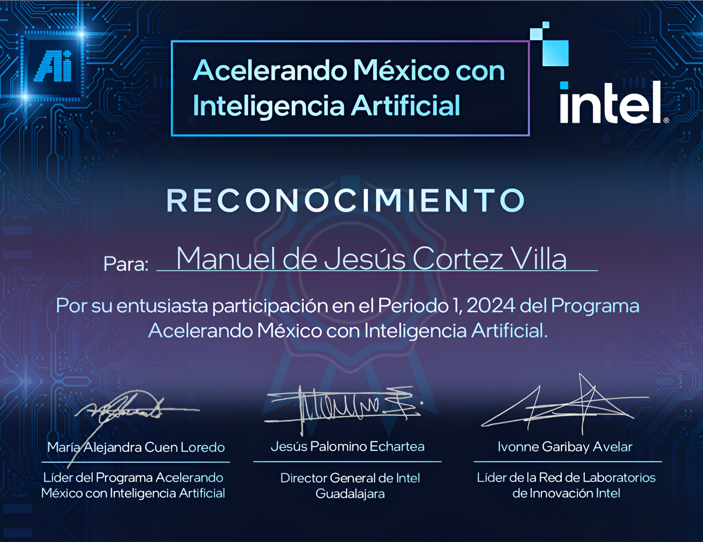

# 👨‍💻 Manuel de Jesus Cortez Villa

I use **Artificial Intelligence**, **Machine Learning**, and **Data Engineering** to design models that predict outcomes, process data efficiently, and evaluate results using Python tools.

## 💻 **Technical Skills**

### **Machine Learning & AI** 

- Linear Regression, Decision Trees, Random Forests
- Principal Component Analysis (PCA), Dimensionality Reduction
- Model Evaluation: MSE, R², F1-Score, Confusion Matrix

### **Languages**
- 🐍 **Python** - Data Analysis & ML
- ☕ **Java** - Data structures and algorithms
- 🗃️ **SQL** - Database modeling and querying

## 📫 **Connect with Me:**
- [Gmail](mailto:mdjesuscv@gmail.com)

