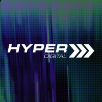
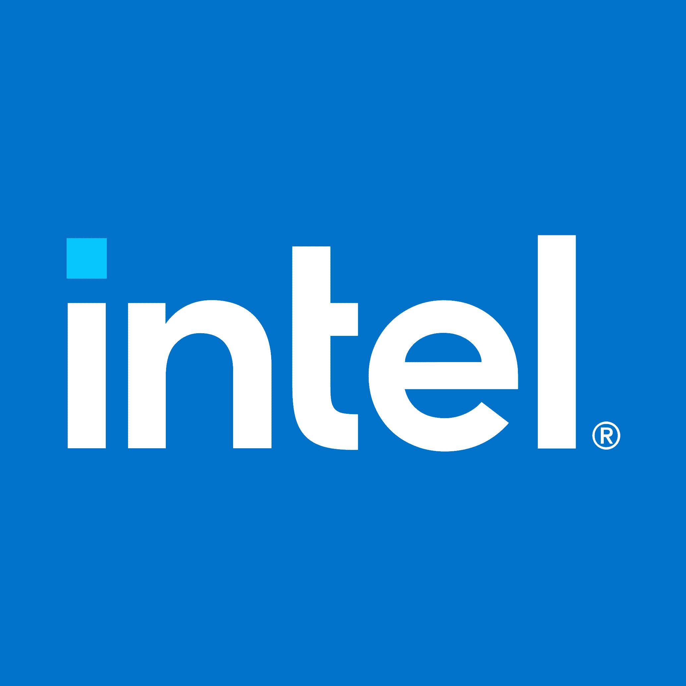

###### `EXPERIENCE`
# Where I've been **building.**

<table border="0" cellspacing="0" cellpadding="16">
<tr>
<td width="50%" valign="top">

<h3>&nbsp;&nbsp;AI Software Developer</h3>

**@HyperDigital**

Production AI systems — agents, workflows and evaluations powering B2B ops and growth.

<kbd>&nbsp;Active&nbsp;</kbd> &nbsp; `2025 — Present`

</td>
<td width="50%" valign="top">

<h3>&nbsp;&nbsp;Software Engineering</h3>

**@ITSON**

Software engineering, algorithms, data structures and applied machine learning.

<kbd>&nbsp;Active&nbsp;</kbd> &nbsp; `2023 — 2027`

</td>
</tr>
<tr>
<td valign="top">

<h3>&nbsp;&nbsp;NVIDIA Inception</h3>

**Program Member**

NVIDIA's acceleration program for AI‑first ventures — compute, tooling and ecosystem access.

</td>
<td valign="top">

<h3>&nbsp;&nbsp;Acelerando México con IA</h3>

**Intel National Recognition**

Intel‑backed program recognizing work advancing AI research and adoption across México.

</td>
</tr>
</table>

 

###### `TECH STACK`
# Tools I use to **ship fast.**

